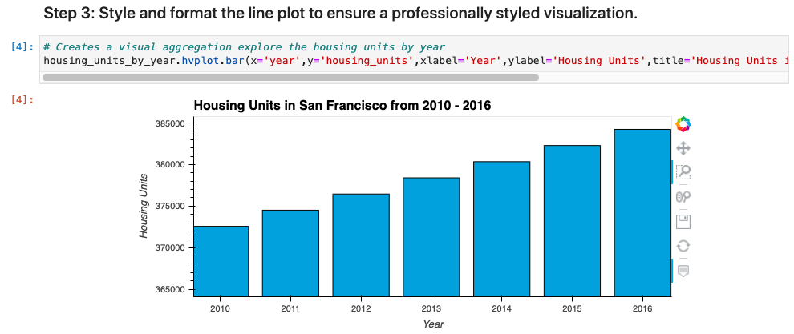

# SF_Real_Estate_Analysis
An analysis of the SF real estate market and whether or not a one-click buy and rent strategy is feasible for the area. 

---

## Technologies

This application is written in Python v. 3.9.7 and uses [JupyterLab](https://jupyter.org/) to deploy the code. This application makes use of
 the following libraries:


[pandas](https://pandas.pydata.org/docs/) was used for data collection, preparation, and analysis.

[pathlib](https://docs.python.org/3/library/pathlib.html) was used to import csv files into jupyter lab workspace

[hvplot](https://hvplot.holoviz.org/) was used to plot and visualize various data sets


---

## Installation Guide

Prior to running this application, perform the following in the command line to install the required libraries:

`pip install pandas`

`pip install jupyterlab`

`pip install pathlib`

`pip install hvplot`

---

## Usage

In order to launch the application, navigate to the SF_Real_Estate_Analysis folder that contains all of the code for this application, and then type into the command line:

```
jupyter lab
```

Once in jupyter lab, open the san_francisco_housing.ipynb file and run each cell in the jupyter file to see the resulting anlysis. All of the resulting graphs can then be visualized in a variety of ways by using the tools on the right hand side of the graph.

Below is an example of a cell's input code and the resulting output of the cell after zooming in using the tools provided by the graph:



---

## Contributors

Robby Odum, Email: rodum012@gmail.com

---

## License

MIT